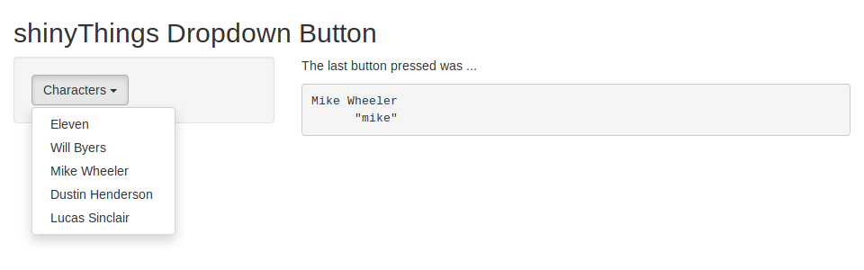
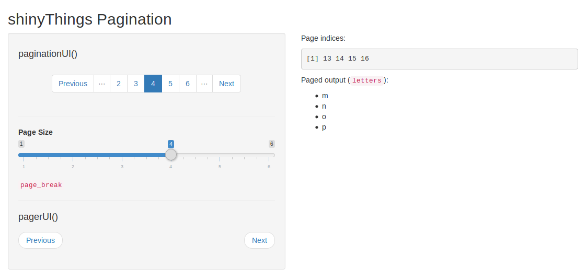
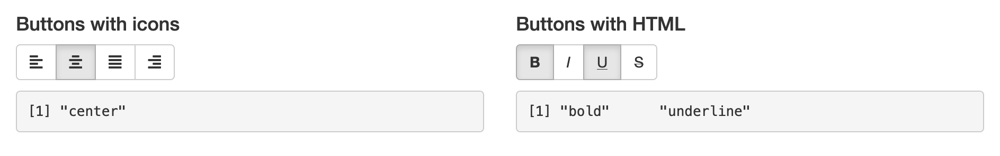

<!-- README.md is generated from README.Rmd. Please edit that file -->

```{r setup, include = FALSE}
knitr::opts_chunk$set(
  collapse = TRUE,
  eval = FALSE,
  comment = "#>",
  fig.path = "man/figures/README-",
  out.width = "100%"
)
```

# shinyThings

[shiny]: https://shiny.rstudio.com

**shinyThings** is a collection of reusable [Shiny] components (modules and inputs).

> My personal DRY storage for [Shiny] bits I've used in my projects.

## Installation

You can install shinyThings from Github via

```r
# install.packages("devtools")
devtools::install_github("gadenbuie/shinyThings")
```

## Components

- [Dropdown Buttons](#dropdownbutton)
- [Pagination UI](#pagination)
- [Toggle Button Groups](#toggle-button-groups)
- [Radio Switch Buttons](#radio-switch-buttons)
- [Undo/Redo History](#undoredo-history)

### dropdownButton



Implements [Bootstrap 3 Button Dropdowns](https://getbootstrap.com/docs/3.3/components/#btn-dropdowns) using Shiny modules.

```{r}
# Try it out
shinyThings::buttonGroupDemo()
```

<details><summary>Demo Code</summary>

```{r}
button_options <- c(
  "Eleven" = "eleven",
  "Will Byers" = "will",
  "Mike Wheeler" = "mike",
  "Dustin Henderson" = "dustin",
  "Lucas Sinclair" = "lucas"
)

ui <- fluidPage(
  titlePanel("shinyThings Dropdown Button"),
  sidebarLayout(
    sidebarPanel(
      shinyThings::dropdownButtonUI(
        id = "dropdown",
        options = button_options,
        label = "Characters"
      )
    ),
    mainPanel(
      tags$p("The last button pressed was ..."),
      verbatimTextOutput("chosen")
    )
  )
)

server <- function(input, output) {
  last_clicked <- shinyThings::dropdownButton("dropdown", button_options)
  output$chosen <- renderPrint({ last_clicked() })
}
```

</details>

## Pagination



Implements [Bootstrap 3 pagination and pagers](https://getbootstrap.com/docs/3.3/components/#pagination) using Shiny modules.

```{r}
# Try it out
shinyThings::pagerDemo()
```

<details><summary>Demo Code</summary>

```{r}
ui <- fluidPage(
  titlePanel("shinyThings Pagination"),
  sidebarLayout(
    sidebarPanel(
      width = 6,
      
      tags$h4("paginationUI()"),
      shinyThings::paginationUI("pager", width = 12, offset = 0, class = "text-center"),
      tags$hr(),
      
      sliderInput("page_break", "Page Size", min = 1, max = 6, step = 1, value = 3),
      helpText(tags$code("page_break")),
      tags$hr(),
      
      tags$h4("pagerUI()"),
      shinyThings::pagerUI("pager", centered = FALSE)
    ),
    mainPanel(
      width = 6,
      
      tags$p("Page indices:"),
      verbatimTextOutput("page_indices"),
      
      tags$p(HTML("Paged output (<code>letters</code>):")),
      uiOutput("paged_output")
    )
  )
)

server <- function(input, output) {
  ## page_break and n_items can be reactive or fixed values
  # page_break <- 4
  # n_items <- length(letters)
  n_items <- reactiveVal(length(letters))
  page_break <- reactive({input$page_break})

  page_indices <- shinyThings::pager("pager", n_items, page_break)

  output$page_indices <- renderPrint({
    page_indices()
  })

  output$paged_output <- renderUI({
    tags$ul(
      lapply(letters[page_indices()], tags$li)
    )
  })
}
```
</details>


### Toggle Button Groups



Implements groups of toggle buttons using [Bootstrap 3 button toolbars](https://getbootstrap.com/docs/3.3/components/#btn-groups) as a Shiny input.
Each button can be toggled **on** or **off**, and the group may be limited to a single **on** button at a time, or multiple active buttons.
(For one-button-always-selected behavior, see [radio switch buttons](#radio-switch-buttons) below.)

```{r}
# Try it out
shinyThings::buttonGroupDemo()

# UI Side
shinyThings::buttonGroup("input-id", choices = letters[1:3])

# Server Side
shinyThings::updateButtonGroupValue("input-id", values = "b")
```

<details><summary>Demo Code</summary>

```{r}
library(shiny)

ui <- fluidPage(
  titlePanel("shinyThings Toggle Button Groups"),
  fluidRow(
    column(
      width = 6,
      tags$h4("Buttons with icons"),
      shinyThings::buttonGroup(
        inputId = "button_icon",
        choices = c("left", "center", "justify", "right"),
        btn_icon = paste0("align-", c("left", "center", "justify", "right")),
        multiple = FALSE
      ),
      tags$p(),
      verbatimTextOutput("chosen_icon")
    ),
    column(
      width = 6,
      tags$h4("Buttons with HTML"),
      shinyThings::buttonGroup(
        inputId = "button_html",
        choices = c("bold", "italic", "underline", "strikethrough"),
        choice_labels = list(
          HTML("<strong>B</strong>"),
          HTML("<i>I</i>"),
          HTML("<span style='text-decoration: underline'>U</span>"),
          HTML("<del>S</del>")
        ),
        multiple = TRUE
      ),
      tags$p(),
      verbatimTextOutput("chosen_html")
    )
  )
)

server <- function(input, output, session) {
  output$chosen_icon <- renderPrint(input$button_icon)
  output$chosen_html <- renderPrint(input$button_html)
}

shinyApp(ui, server)
```

</details>

### Radio Switch Buttons


Implements a button-styled version of `shiny::radioButtons()`.
One button is always active (unless unset by the app).

Adapted from CSS code by Mike Hemberger described in <https://thestizmedia.com/radio-buttons-as-toggle-buttons-with-css/>.

```{r}
# Try it out
shinyThings::radioSwitchButtonsDemo()

# UI Side ----
# Set Default style
shinyThings::radioSwitchButtons_default_style(selected_background = "#00589a")
# Create input
shinyThings::radioSwitchButtons("input-id", choices = letters[1:5])

# Server Side ----
shinyThings::updateRadioSwitchButtons("input-id", selected = "b")
```

<details><summary>Demo Code</summary>

```{r}
library(shiny)
library(shinyThings)

ui <- fluidPage(
  inputPanel(
    radioSwitchButtons(
      inputId = "other",
      label = "Yes or No?",
      choices = c("Yes" = "yes", "No" = "no", "Maybe?" = "maybe"),
      selected_background = "#eb1455"
    ),

    radioSwitchButtons(
      inputId = "small",
      label = "Style",
      choices = c("plain", "bold", "italic"),
      choice_labels = list(
        tags$span(style = "font-weight: normal", "P"),
        tags$strong("B"),
        tags$em("I")
      )
    )
  ),
  verbatimTextOutput("values")
)

server <- function(input, output, session) {
  output$values <- renderPrint({
    str(list(
      moreThanTwo = input$other,
      style       = input$small
    ))
  })
}

shinyApp(ui, server)
```

</details>

### Undo/Redo History


A Shiny module for undo/redo history. 
The Shiny module accepts an arbitrary reactive data value. 
Changes in the state of this reactive value are tracked and added to the user's history. 
The user can then repeatedly undo and redo to walk through this stack. 
The module returns the current selected value of the reactive from this historical stack, 
or `NULL` when the app state was changed by the user.

``` r
# Try it out
shinyThings::undoHistoryDemo()

# UI Side ----
# UI with undo/redo buttons
undoHistoryUI("module-id")

# Server Side ----
# Create a reactive value whose state will be tracked. Note that you control 
# the structure of the data being tracked and also how the data will be 
# restored. `undo_app_state` will have the same structure.
undo_app_state <- undoHistory("module-id", value = reactive({
  list(
    text = input$a_text_input_id,
    selected = input$a_select_input_id
  )
}))

# Use an observer to update inputs as required as the user steps through the
# undo/redo history stack.
observe({
  req(!is.null(undo_app_state))
  updateTextInput(session, "a_text_input_id", value = undo_app_state()$text)
  updateSelectInput(session, "a_select_input_id", selected = undo_app_state()$selected)
})
```
